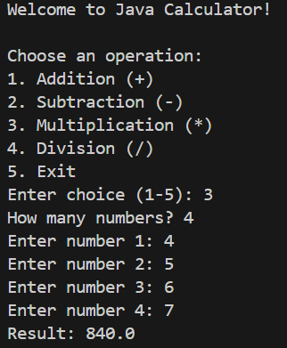
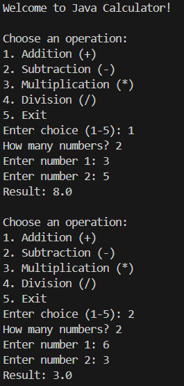

# Java Console Calculator

A basic command-line calculator built with Java. Supports:

- Addition
- Subtraction
- Multiplication
- Division
- Multiple number inputs
- Repeated operations in a loop until exit

## How to Run

1. Compile the program:
   ```bash
   javac Calculator.java

Tools used:
Java (JDK 17+ recommended)
Visual Studio Code
Terminal / PowerShell

## Screenshots

Here is the calculator running:




